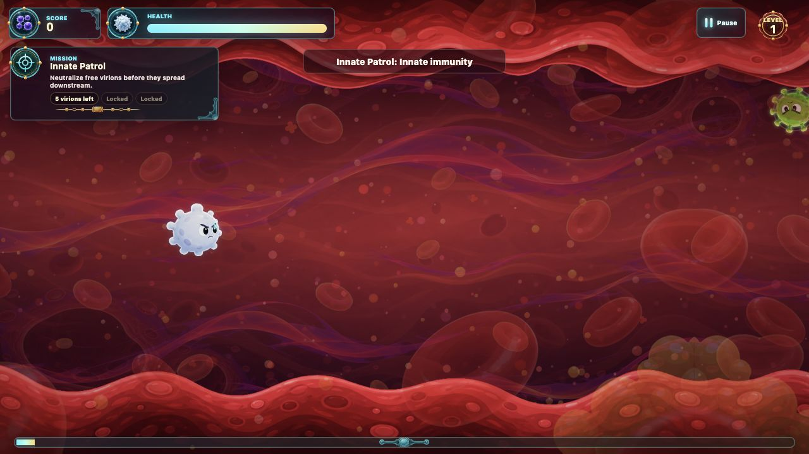
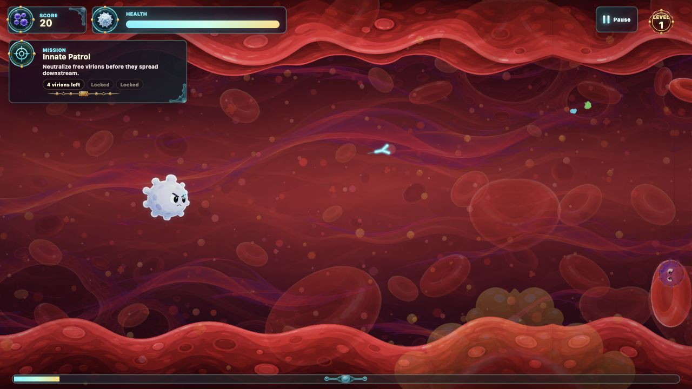
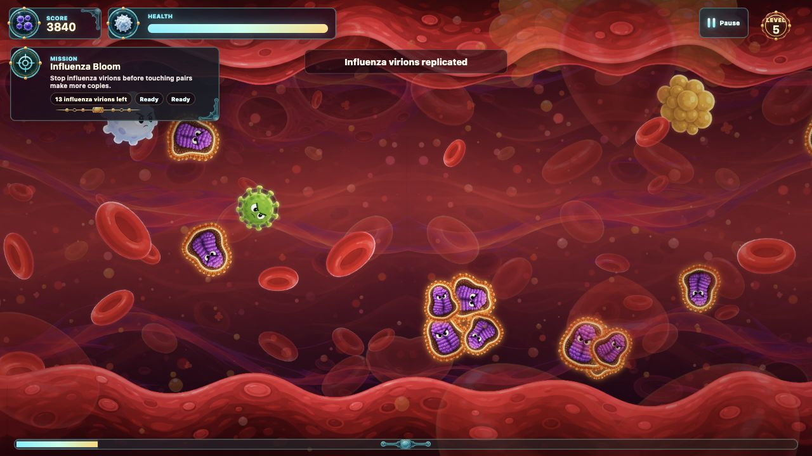
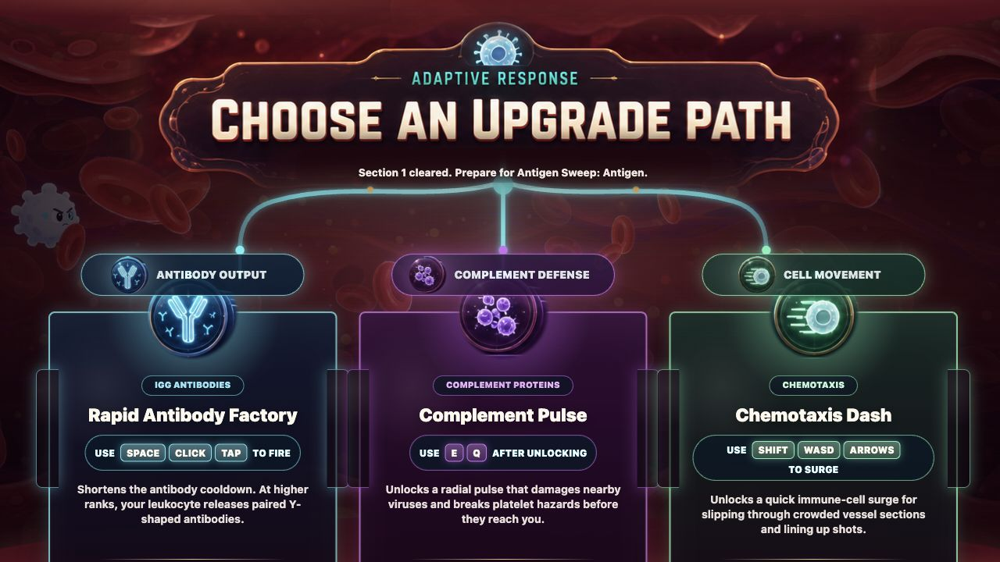
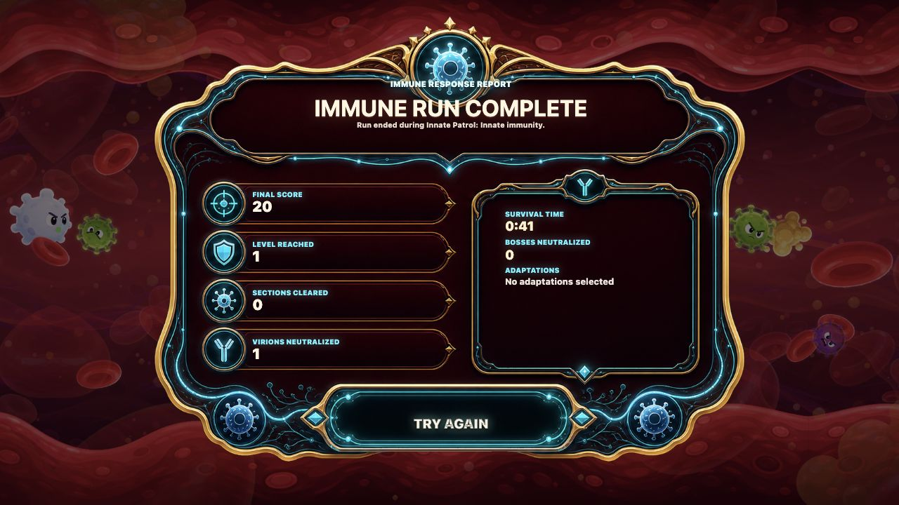

# Bloodstream Defender

Bloodstream Defender is a browser-based arcade game about piloting a white blood cell through a stylized bloodstream. You dodge red blood cells and platelet clots, lock onto incoming viruses, fire Y-shaped antibody projectiles, and adapt between levels with immune-system upgrades.

The project started from a simple idea: I have always wanted to make a game about what is happening inside the body. The goal is to keep the science recognizable, with white blood cells, antibodies, platelets, influenza virions, immune terms, and bloodstream motion, while still making the game feel fast, readable, and playful.

## Play The Demo

The easiest way to try the current build is the hosted demo:

[https://humble-marvel-dx2j.here.now/](https://humble-marvel-dx2j.here.now/)

On desktop, open the link and click **Start Run**. On phones, rotate to landscape and tap **Start Run** once so the browser can unlock music and sound effects.

## Project Highlights

- Static HTML, CSS, and JavaScript game with no build step
- Phaser/WebGL playfield renderer for smoother sprite, projectile, particle, and parallax performance
- DOM-based HUD and menus so score, health, upgrades, pause controls, and run summaries stay crisp and easy to tune
- Level-based arcade structure with escalating difficulty and late-stage boss or mini-boss encounters
- Roguelite upgrade tree with practical immune-system abilities between levels
- Educational mission language using terms like innate immunity, antigen, complement system, chemotaxis, phagocytosis, and adaptive immunity
- Threat-based auto lock-on that prioritizes nearby incoming enemies without cluttering the screen with lock-on rings
- Homing Y-shaped antibody projectiles, complement pulse, and upgraded Chemotaxis Dash
- Influenza virions that multiply on contact and push outward, creating target-priority pressure
- Generated bloodstream backgrounds, sprite assets, HUD ornaments, upgrade UI, and game-over report art
- Multi-layer parallax bloodstream environment
- Desktop controls plus landscape mobile controls with a left thumb joystick and right-side combat buttons
- Mobile-only HUD simplification that hides the mission panel during play so the touch controls and playfield have room
- Mobile performance path for rapid antibody fire, including optimized WebGL shot rendering and lightweight mobile combat SFX
- Layered audio with music, ambience, boss warnings, combat effects, upgrade sounds, pause sounds, separate music/effects mute buttons, and mobile combat audio ducking so shots and hits cut through the music

## Screenshots

**Title screen**


**HUD, mission panel, and bloodstream playfield**



**Antibody projectiles**



**Influenza enemy mission**



**Roguelite upgrade tree**



**Pause menu with audio controls**


**End-of-run summary**



## Play Locally

This is a static web game. You do not need to install dependencies or run a build command, but you should serve the folder through a local web server instead of opening `index.html` directly. A local server lets the browser load JavaScript modules, images, and audio files correctly.

### Requirements

- Git
- Python 3, which is included on many systems and is only used here to serve the static files
- A modern browser such as Chrome, Edge, Firefox, or Safari

### Steps

```bash
git clone https://github.com/Niko2756/bloodstream-defender-game.git
cd bloodstream-defender-game
python3 -m http.server 8000
```

Then open this address in your browser:

```text
http://localhost:8000/
```

If port `8000` is already in use, choose another port:

```bash
python3 -m http.server 8080
```

Then open:

```text
http://localhost:8080/
```

On Windows, if `python3` is not available, try:

```bash
py -m http.server 8000
```

## Controls

### Desktop

| Action | Input |
| --- | --- |
| Move | `WASD` or arrow keys |
| Fire antibodies | `Space`, mouse click, or tap |
| Chemotaxis Dash | `Shift` after choosing the Chemotaxis Dash upgrade |
| Complement Pulse | `E`, `Q`, `Enter`, or `Numpad Enter` after choosing the Complement Pulse upgrade |
| Pause or resume | `P`, `Escape`, or the pause button |
| Restart run | Pause menu or end screen |

### Mobile Web

The mobile version is designed for landscape play.

| Action | Input |
| --- | --- |
| Move | Left thumb joystick |
| Fire antibodies | Hold the **Fire** button |
| Chemotaxis Dash | Tap **Dash** after unlocking it |
| Complement Pulse | Tap **Pulse** after unlocking it |
| Pause or resume | Pause button in the top-right HUD |

For the most full-screen iPhone experience, open the live demo in Safari, tap the Share button, and choose **Add to Home Screen**. The regular Safari and Chrome browser toolbars still take some vertical space, so the game is tuned to keep its important mobile controls and overlays reachable even inside the browser.

The mission panel is intentionally hidden during landscape mobile gameplay. The level name, target count, and objective still appear through level-complete, upgrade, and boss-flow screens, while the in-game HUD stays focused on score, health, level, pause, progress, and touch controls.

## Game Flow

Each level is a vessel section with a mission objective and an immune-system term. After clearing a section, the game shows a level-complete report with score, neutralized targets, remaining health, and the next mission preview.

The player then chooses one adaptation from the upgrade tree:

- **Antibody Output** improves antibody fire rate, projectile count, and antibody damage.
- **Complement Defense** unlocks and improves the radial complement pulse.
- **Cell Movement** unlocks and improves Chemotaxis Dash for quick repositioning.

Once every upgrade branch is fully adapted, the level-complete screen changes from **Choose Adaptation** to **Continue** and sends the player straight into the next level.

## Enemies And Bosses

Early levels focus on readable arcade combat: incoming viruses, platelet hazards, and antibody timing. Later levels add stronger enemy mixes, influenza virions, and end-of-section boss encounters.

- Influenza virions begin appearing in level 4.
- Matching influenza virions multiply when they touch, then push outward so the bloom spreads instead of stacking in one place.
- Boss and mini-boss encounters begin near the end of later levels, after a warning rumble.
- Bosses are meant to act as a surprise escalation, not the entire level.

## Audio

The game uses a layered audio system:

- Menu, vessel combat, high-danger combat, upgrade, boss-warning, and boss-loop music
- Bloodstream ambience under active gameplay
- Level-clear sting before upgrade music begins
- Boss-warning rumble before the boss appears, then boss-loop music during the fight
- Separate sound effects for antibody shots, hits, boss hits, boss phase changes, boss defeat, influenza replication, budding-virus split, platelet impact, player damage, player death, pause/resume, UI selection, and upgraded dash
- Pause-menu toggles for music and effects
- Mobile combat SFX budgeting for rapid-fire situations, using lightweight Web Audio tones for the highest-frequency shot and hit feedback on touch devices
- Brief mobile music/ambience ducking when shots and hits play, so the action remains audible without returning to the stutter caused by overlapping many large audio elements

## Performance Notes

The prototype started as a Canvas-first game and later moved the active playfield to Phaser/WebGL while preserving the same artwork, gameplay feel, HUD, and upgrade flow. Phaser handles the sprite-heavy bloodstream scene more efficiently, especially on mobile, while the existing HTML/CSS screens keep the custom UI art and readable text.

The mobile build also uses a few targeted optimizations:

- WebGL-rendered parallax layers, enemies, player sprite, and projectiles
- Simplified mobile projectile drawing when many antibodies are active
- Capped visible particle density on touch devices
- Mobile-only combat SFX rate limits and Web Audio tones for rapid shot/hit sounds
- CSS gesture blocking and fixed viewport rules to reduce accidental zoom while tapping the Fire button

The desktop build keeps the richer projectile sprites and full audio assets where performance is less constrained.

## Project Structure

```text
.
├── index.html          # Game canvas, overlays, HUD, and screen markup
├── styles.css          # HUD, menus, mobile layout, overlays, and responsive styling
├── src/game.js         # Game loop, input, combat, spawning, level flow, audio, and drawing
├── vendor/             # Vendored Phaser runtime used by the WebGL playfield
├── assets/             # Runtime art, sprites, audio, UI assets, and backgrounds
└── docs/               # Design notes, reference material, and README screenshots
```

## Development Notes

Bloodstream Defender is still deployed as a simple static site, but the playfield now uses Phaser/WebGL for the performance-critical rendering work. The HUD, pause menu, level-complete screen, upgrade tree, and game-over report remain regular HTML/CSS so they can stay readable, accessible, and easy to iterate.

The visual target is a semi-accurate, semi-cartoony bloodstream: readable biology silhouettes, expressive enemies, rich red plasma layers, and arcade-friendly combat clarity.

The design direction is an educational roguelite arcade game. Each cleared vessel section introduces immune-system language, and each upgrade gives the player a practical antibody adaptation that also teaches how to use the new ability.
