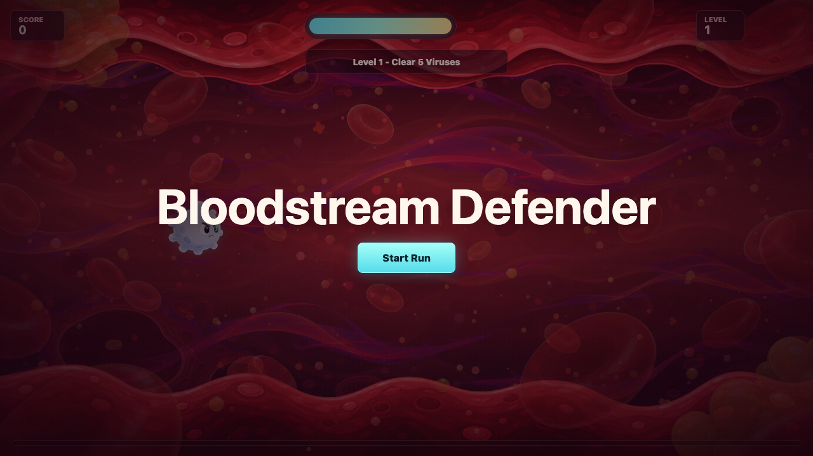
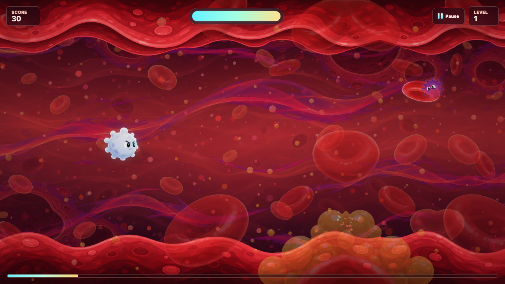
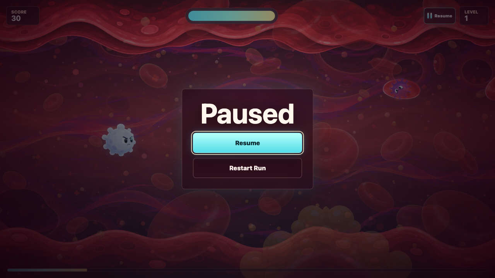

# Bloodstream Defender

Bloodstream Defender is a small browser game about piloting a white blood cell through a stylized blood vessel, locking onto viruses, and firing antibody-shaped projectiles before they crash into you.

The idea started from a simple wish: I have always wanted to make a game about what is happening inside the body. The goal is to keep the science recognizable, with white blood cells, red blood cells, antibodies, platelets, viruses, and bloodstream motion, while still letting the whole thing feel cartoony, fast, and playful.

## Screenshots







## Play Locally

This is a static HTML/CSS/JavaScript game. There is no build step and no package install.

```bash
git clone https://github.com/Niko2756/bloodstream-defender-game.git
cd bloodstream-defender-game
python3 -m http.server 8000
```

Then open:

```text
http://localhost:8000/
```

## Controls

- Move: `WASD` or arrow keys
- Fire antibodies: `Space`, click, or tap
- Pause/resume: `P`, `Escape`, or the pause button
- Restart: use the pause menu or the end screen

## Current Features

- Level-based blood vessel sections with progress and virus-clear goals
- Swim-like movement with inertia and quick left/right surge animation
- Threat-based auto lock-on that prioritizes nearby incoming viruses without visible lock-on rings
- Homing antibody projectiles shaped more like small Y-shaped antibodies
- Generated white blood cell, virus, platelet, red blood cell, and antibody sprites
- Multi-layer generated blood-vessel backgrounds with parallax scrolling
- Pause menu, health bar, score, level display, and level progress bar
- Procedural sound effects for shooting, movement surges, and virus pops

## Project Structure

- `index.html` contains the game canvas and HUD markup.
- `styles.css` controls the page, HUD, start overlay, and pause menu styling.
- `src/game.js` contains the game loop, movement, combat, spawning, drawing, audio, and state handling.
- `assets/` contains generated concept art, sprites, and parallax background layers.
- `docs/` contains art direction notes, asset pipeline notes, parallax notes, and README screenshots.

## Development Notes

The prototype currently uses vanilla Canvas instead of a game engine so the early design can stay lightweight and easy to change. The visual target is a semi-accurate, semi-cartoony bloodstream: readable biology silhouettes, expressive enemies with eyes, rich red plasma layers, and arcade-friendly combat clarity.
