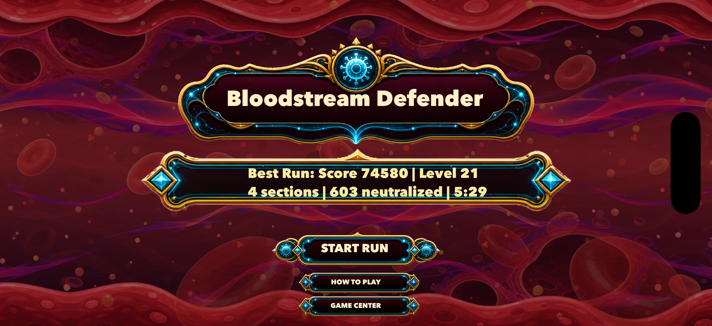
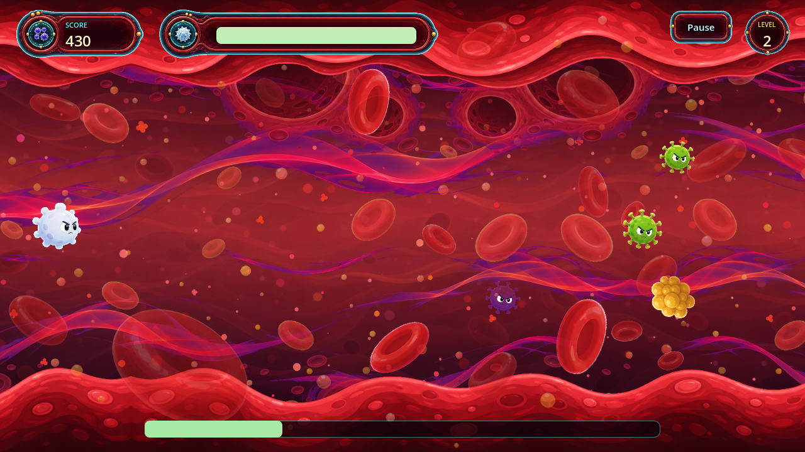
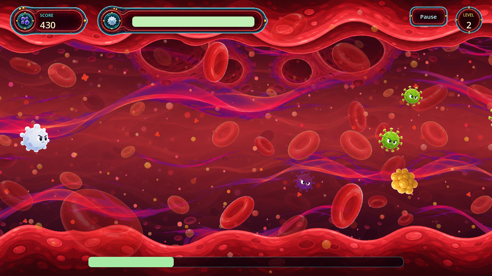
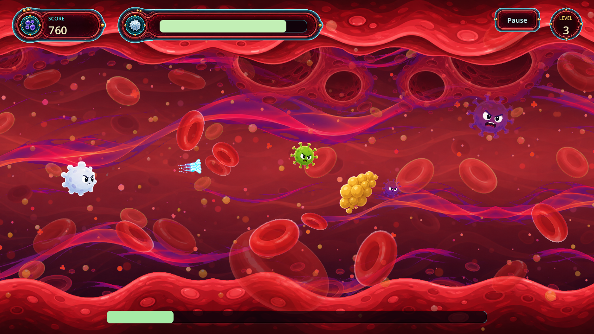
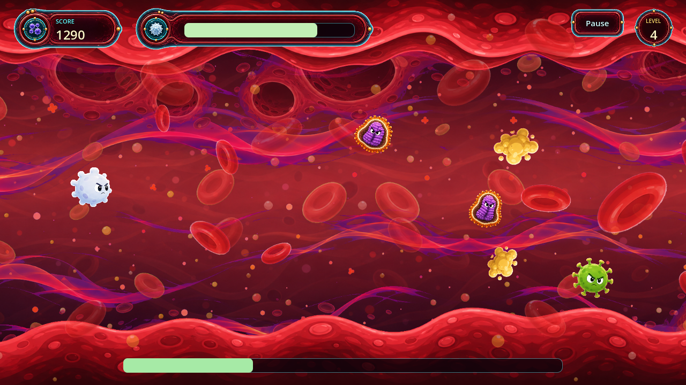
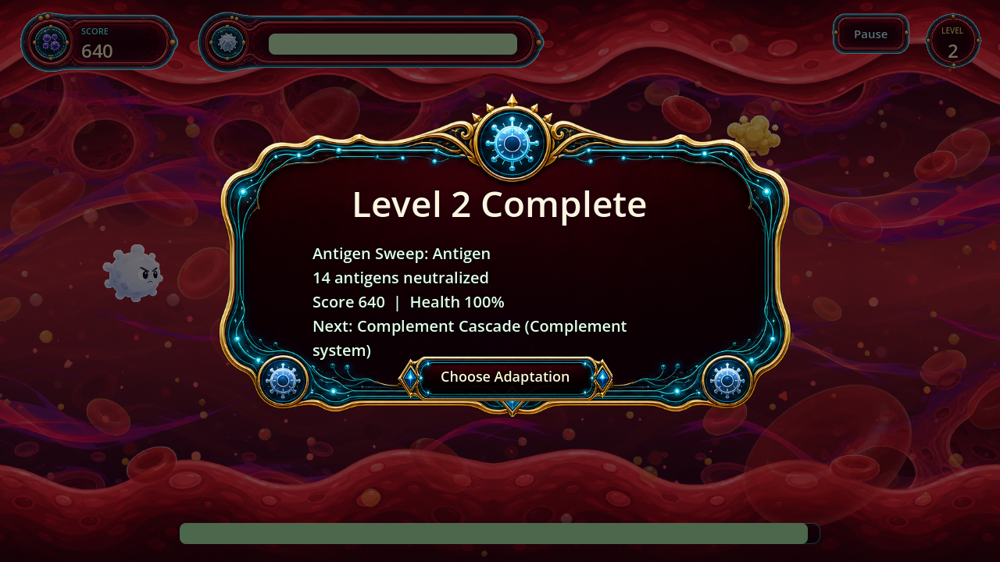
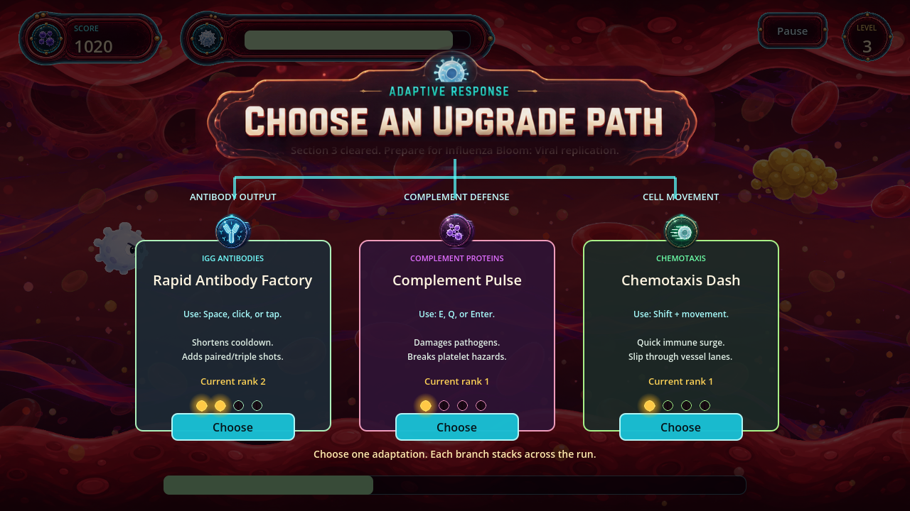
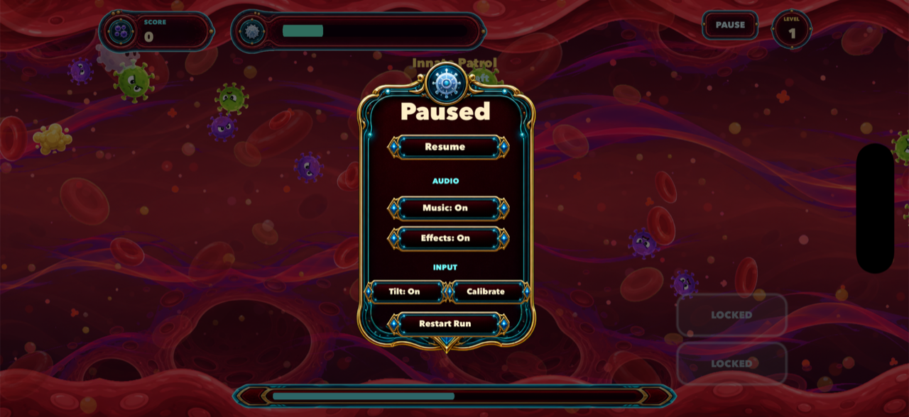
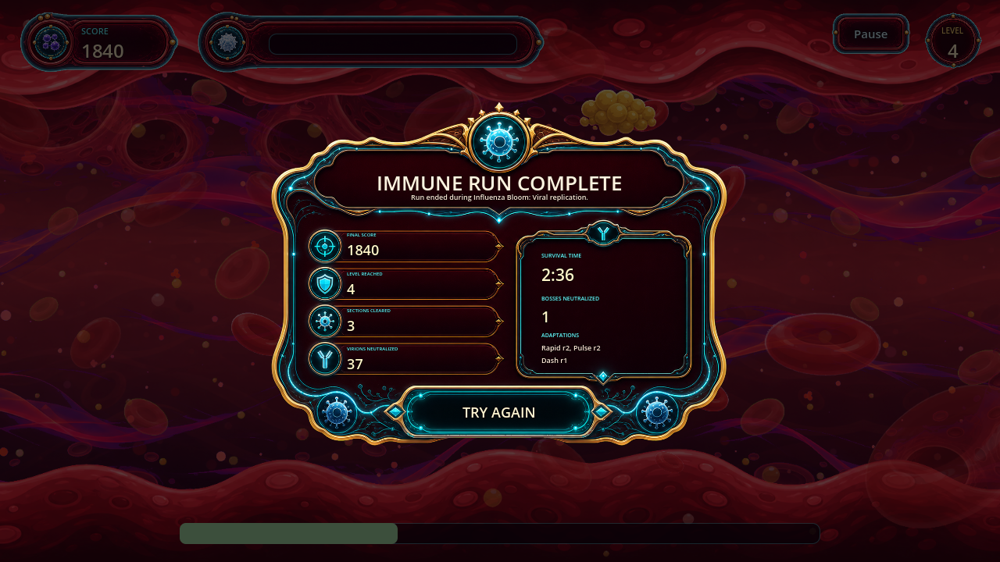

# Bloodstream Defender Godot Port

Bloodstream Defender is a 2D arcade game about piloting a white blood cell through a stylized bloodstream. You dodge red blood cells and platelet clots, neutralize viruses with Y-shaped antibodies, and adapt between vessel sections with immune-system upgrades.

This branch contains the Godot version of the game. The current goal is a polished Godot build with the updated themed HUD, pause menu, level-complete flow, upgrade tree, run-complete screen, parallax bloodstream background, and layered audio.

## Current Branch

```text
bloodstream-defender-godot-port
```

This README is scoped to the Godot build only.

## Highlights

- Godot 4.7 project with `scenes/main.tscn` as the main scene
- Single-script gameplay runtime in `scripts/godot/main.gd`
- Themed score, health, pause, level, progress, level-complete, pause, upgrade, and run-complete UI
- Multi-layer parallax bloodstream background with cleaned looping layers
- Arcade combat with homing antibody projectiles, platelet hazards, red blood cell traffic, influenza enemies, and later boss encounters
- Roguelite adaptation tree for antibody output, complement pulse, and chemotaxis dash
- Complement pulse that clears viruses and platelet obstructions inside its expanding sphere
- Audio system with menu, combat, danger, upgrade, ambience, boss, pause, hit, damage, pulse, dash, and level-complete cues
- Pause menu toggles for music and effects
- Fullscreen-aware viewport layout so expanded windows do not leave unused dark bars

## Screenshots

**Title screen**



**Active gameplay HUD**



**Bloodstream playfield**



**Antibody fire**



**Influenza enemies**



**Level complete**



**Upgrade tree**



**Pause menu**



**Run complete**



## Run Locally

### Requirements

- Git
- Godot 4.7 or newer

### Open In Godot

1. Clone the repository.
2. Check out the Godot branch.
3. Open the project folder in Godot.
4. Run the main scene.

```bash
git clone https://github.com/Niko2756/bloodstream-defender-game.git
cd bloodstream-defender-game
git checkout bloodstream-defender-godot-port
```

The Godot project file is:

```text
project.godot
```

The configured main scene is:

```text
res://scenes/main.tscn
```

## iOS / App Store

The recommended iOS path is the Godot export, not a web wrapper. The current iOS port notes, export-template steps, signing blockers, and App Store QA checklist are in:

```text
docs/ios-app-store-port.md
```

## Controls

| Action | Input |
| --- | --- |
| Move | `WASD` or arrow keys |
| Fire antibodies | `Space` or left mouse click |
| Chemotaxis Dash | `Shift` after choosing the Chemotaxis Dash upgrade |
| Complement Pulse | `E`, `Q`, `Enter`, or `Numpad Enter` after choosing the Complement Pulse upgrade |
| Pause or resume | `P`, `Escape`, or the pause button |
| Restart run | Pause menu or run-complete screen |

## Game Flow

Each level is a vessel section with an immune-system mission term. The player clears virions, antigens, influenza blooms, platelet hazards, and later boss threats while staying alive.

After a level is cleared, the level-complete screen shows the mission result, score, remaining health, and the next vessel section. If adaptations remain, the player chooses one upgrade branch before continuing. If every branch is fully adapted, the level-complete button changes to **Continue** and moves straight into the next level.

## Adaptations

| Branch | Theme | Gameplay Role |
| --- | --- | --- |
| Rapid Antibody Factory | IgG antibodies | Faster fire rate, paired shots, stronger hits, and triple spread |
| Complement Pulse | Complement proteins | Expanding pulse sphere that damages pathogens and destroys platelet hazards |
| Chemotaxis Dash | Chemotaxis | Quick repositioning burst with improved recovery and safety at higher ranks |

## Project Structure

```text
.
├── project.godot                 # Godot project configuration
├── scenes/main.tscn              # Main Godot scene
├── scripts/godot/main.gd         # Gameplay, UI, audio, spawning, and level flow
├── assets/                       # Runtime sprites, UI art, audio, and parallax backgrounds
├── docs/screenshots/             # README screenshots captured from the Godot build
└── docs/                         # Godot port notes, art direction, and asset pipeline docs
```

## Development Notes

The visual target is a readable, semi-cartoony bloodstream with strong arcade clarity: rich red plasma layers, expressive pathogens, bright platelet hazards, ornate immune-themed UI, and live Godot text for labels and numbers.

When adding or revising UI art, keep generated assets modular and compose them in Godot. Avoid baked full-screen mockups when text needs to stay readable or adjustable in-engine.
